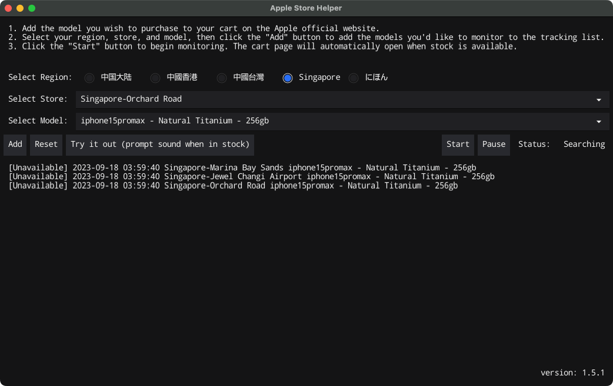

# Apple Store Reservation Assistant

## Supports iPhone 15 Series



## Important Notes
* *It's just a tool to listen to inventory and alerts*
* *Log in ahead of time.*
* *Add the model you wish to purchase to your cart in advance. The tool will open the cart page when stock is available, but manual store selection on the cart page is required.*

## Development Details
* Code is not elegant, comments are incomplete—review with caution.
* GUI framework: [fyne](https://github.com/fyne-io/fyne)

### Running the Program
```shell script
go run main.go
```

### Building the App
```
# Packaging on a Mac OS environment
go install fyne.io/fyne/v2/cmd/fyne
go install github.com/fyne-io/fyne-cross

fyne-cross darwin -arch=amd64,arm64 -app-id=apple.store.helper
fyne-cross windows -arch=amd64,386 -app-id=apple.store.helper
```

If you encounter a `fyne-cross: command not found` error, please configure your GO environment variables.
Add the following lines to your `~/.zshrc` or `~/.bashrc` file:
```shell script
# GOLANG
export GOROOT=/usr/local/go
export GOPATH=$HOME/go
export PATH=$PATH:$GOPATH/bin
```
Change `GOROOT` to your actual GO installation directory.

## How to Use

1. Navigate to the [release](https://github.com/hteen/apple-store-helper/releases) page and download the software for your OS, then launch it.
2. Add the model you wish to purchase to your cart on the Apple official website.
3. Choose the region, store, and model, then click the `Add` button to add the models you want to monitor to the list.
4. Click the `Start` button to begin monitoring. The cart page will automatically open when stock is detected.
5. Monitoring will automatically pause when stock is found, until you click `Start` again.

## Contributors
- [@Hteen](https://github.com/hteen)
- [@Timssse](https://github.com/Timssse)
- [@Black-Hole](https://github.com/BlackHole1)
- [@RayJason](https://github.com/RayJason)

## ☕️

